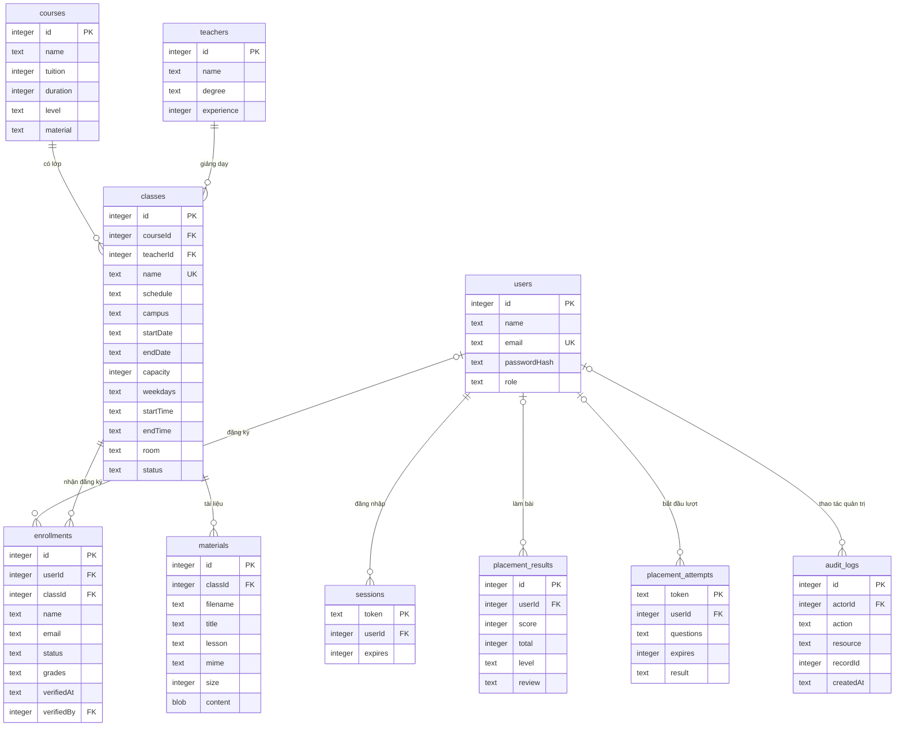
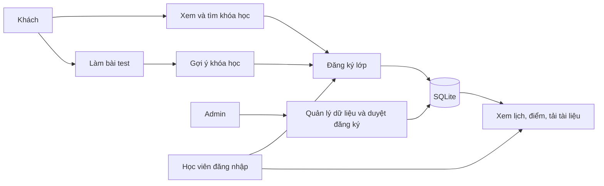

# Cơ sở dữ liệu

SQLite lưu tại `data/center.sqlite`. Schema và ràng buộc chi tiết nằm trong `server/db.js` và `server/migrations.js`.

Các bảng độc lập: `questions` (câu hỏi/4 phương án/đáp án), `news` (bài viết), `contacts` (lời nhắn tư vấn, status, note). `metadata` ghi dấu khởi tạo seed và chuyển đổi lịch. Tổng cộng 14 bảng gồm cả bảng kỹ thuật.

Học viên nằm trong bảng `users` với `role=student`, tránh lưu trùng mật khẩu ở hai bảng. Lịch tuần và cơ sở nằm trong `classes`; điểm kỹ năng nằm ở `enrollments.grades`; tài liệu nằm ở `courses.material`.

## Ràng buộc chính

- Email tài khoản duy nhất, chuẩn hóa chữ thường.
- Một email hoặc userId chỉ có một đăng ký đang hoạt động trong một lớp; bản đã hủy không ngăn đăng ký lại. Unique index theo email và trigger theo userId bảo vệ database.
- Chuyển sang `confirmed` từ trạng thái khác chỉ thành công khi còn chỗ và lớp còn tuyển sinh. `cancelled` không tính vào sĩ số.
- Khi giảm sĩ số tối đa, số mới không được nhỏ hơn số học viên đã xác nhận.
- Quan hệ khóa ngoại ngăn xóa khóa/giáo viên/lớp/học viên còn có dữ liệu liên quan.
- Điểm kỹ năng 0–10, mật khẩu ít nhất 10 ký tự, ngày sinh không ở tương lai.
- Đáp án ngân hàng câu hỏi chỉ trả cho Admin; học viên nhận đáp án của lượt đã nộp để ôn tập. Điểm tính từ snapshot ở server, không nhận điểm client gửi lên.
- Session sử dụng mã ngẫu nhiên, lưu bản băm token trong DB, hết hạn sau 24 giờ; cookie HttpOnly và SameSite=Lax.

Lượt kiểm tra cũng lưu hash của token ngẫu nhiên, snapshot câu hỏi và kết quả JSON. Review bài đã nộp lưu ở `placement_results`, không phụ thuộc việc câu hỏi ngân hàng có bị sửa/xóa sau đó. `materials.content` là BLOB, không có đường dẫn tệp công khai.

Migration bổ sung cột/bảng trong transaction và chỉ phân tích lịch chữ một lần. Không xóa dữ liệu lịch sử. Nếu dữ liệu cũ đã có trùng tài khoản/lớp thì giữ lại để Admin đối soát; trigger ngăn phát sinh trùng mới.

## Use case

