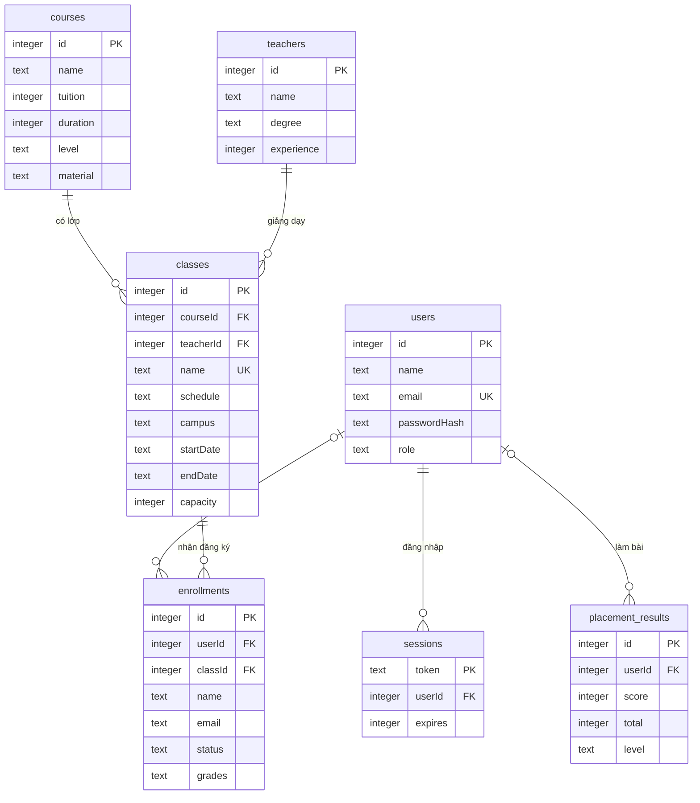
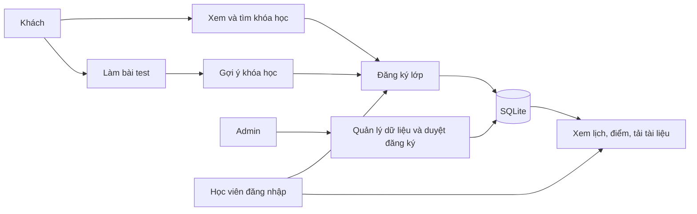

# Cơ sở dữ liệu

SQLite lưu tại `data/center.sqlite`. Schema và ràng buộc chi tiết nằm trong `server/db.js`.

Các bảng độc lập: `questions` (câu hỏi/4 phương án/đáp án), `news` (bài viết), `contacts` (lời nhắn tư vấn). `metadata` ghi dấu đã khởi tạo seed.

Học viên nằm trong bảng `users` với `role=student`, tránh lưu trùng mật khẩu ở hai bảng. Lịch tuần và cơ sở nằm trong `classes`; điểm kỹ năng nằm ở `enrollments.grades`; tài liệu nằm ở `courses.material`.

## Ràng buộc chính

- Email tài khoản duy nhất, chuẩn hóa chữ thường.
- Một email chỉ có một đăng ký đang hoạt động trong một lớp; bản đã hủy không ngăn đăng ký lại.
- `pending → confirmed` chỉ thành công khi còn chỗ. `cancelled` không tính vào sĩ số.
- Khi giảm sĩ số tối đa, số mới không được nhỏ hơn số học viên đã xác nhận.
- Quan hệ khóa ngoại ngăn xóa khóa/giáo viên/lớp/học viên còn có dữ liệu liên quan.
- Điểm kỹ năng 0–10, mật khẩu ít nhất 10 ký tự, ngày sinh không ở tương lai.
- Đáp án câu hỏi chỉ trả về cho Admin. Điểm bài test được tính từ đáp án ở server.
- Session sử dụng mã ngẫu nhiên, lưu bản băm token trong DB, hết hạn sau 24 giờ; cookie HttpOnly và SameSite=Lax.

## Use case

