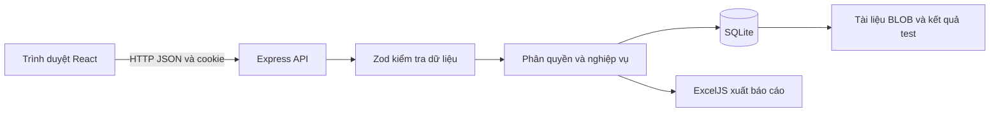
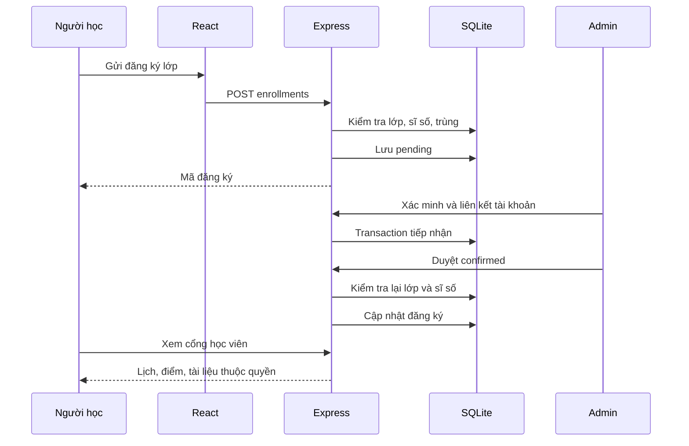

# Báo cáo đồ án: Website trung tâm ngoại ngữ

**Tên sản phẩm:** Vinh English Center  
**Công nghệ:** React, Vite, Express, SQLite trên Node.js 24  
**Ngôn ngữ giao diện:** Tiếng Việt  
**Thông tin sinh viên, lớp, giảng viên:** người nộp bổ sung theo mẫu của trường.

## 1. Bài toán và mục tiêu

Trung tâm cần một nơi công bố khóa học, học phí, giáo viên và lịch khai giảng. Người học cần tìm lớp phù hợp, gửi đăng ký và theo dõi sau khi được tiếp nhận. Người quản trị cần xử lý đăng ký, tránh vượt sĩ số, sắp lịch giáo viên/phòng học, cung cấp tài liệu và theo dõi lượng đăng ký.

Đồ án hiện thực một hệ thống có lưu trữ và phân quyền. React đảm nhận giao diện; Express xác thực, kiểm tra dữ liệu và xử lý nghiệp vụ; SQLite giữ dữ liệu qua những lần khởi động lại. Không dùng localStorage để giả lập đăng ký hoặc tài khoản.

Phạm vi tập trung vào quy trình **xem khóa học, kiểm tra trình độ, đăng ký lớp, Admin tiếp nhận và học viên theo dõi lớp**. Tên trung tâm, học phí, địa chỉ và nhân sự là dữ liệu minh họa.

## 2. Tác nhân và yêu cầu

| Tác nhân | Chức năng |
|---|---|
| Khách | Xem/tìm khóa học, xem giáo viên, lịch khai giảng, tin tức; làm test; gửi đăng ký và lời nhắn; tạo tài khoản |
| Học viên | Đăng nhập, đổi mật khẩu, đăng ký lớp, xem lịch/điểm/kết quả test, tải tài liệu được cấp quyền, sửa hồ sơ |
| Admin | CRUD nội dung, học viên, lớp, câu hỏi; xác minh tiếp nhận, duyệt/hủy đăng ký, nhập điểm, tải tài liệu, xử lý tư vấn và xuất báo cáo |

Yêu cầu phi chức năng: giao diện tiếng Việt sử dụng trên điện thoại; phản hồi rõ khi tải/lỗi/rỗng; kiểm tra quyền tại API; mật khẩu không lưu nguyên văn; không lộ đáp án trước khi nộp; duy trì dữ liệu cũ khi nâng cấp; có kiểm thử lặp lại được.

## 3. Kiến trúc

Trong phát triển, Vite chạy cổng 5173, proxy `/api` sang Express 3001. Bản build do Express phục vụ cùng nguồn với API. SQLite phù hợp mục tiêu dễ cài, một máy chủ và dữ liệu vừa phải của đồ án. Nếu trường bắt buộc MySQL thì cần chuyển lớp truy cập dữ liệu và migration, không chỉ thay cấu hình.

Các module chính: `app.js` định tuyến/xác thực/CRUD; `domain.js` ràng buộc lịch và đăng ký; `placement.js` quản lý lượt kiểm tra; `management.js` tiếp nhận, tài liệu, báo cáo; `migrations.js` nâng cấp schema. Frontend tách trang đăng ký, đăng nhập, bài kiểm tra và học viên.

## 4. Use case đăng ký lớp

**Điều kiện:** lớp tồn tại, còn tuyển sinh, còn chỗ. Người đăng ký cung cấp họ tên, email, số điện thoại và lớp. Nếu đã đăng nhập thì server sử dụng tài khoản hiện tại.

1. Khách chọn khóa và lớp; hệ thống hiển thị lịch, cơ sở, học phí.
2. Người dùng gửi form. Client kiểm tra trường bắt buộc; server kiểm tra lại toàn bộ dữ liệu.
3. Server kiểm tra trạng thái lớp và đăng ký trùng theo email hoặc tài khoản.
4. Lưu đăng ký `pending`, trả mã đăng ký.
5. Với khách chưa có tài khoản, Admin liên hệ xác minh rồi tạo/liên kết tài khoản qua Tiếp nhận.
6. Admin chuyển `confirmed`. Server kiểm tra lại trạng thái tuyển sinh và sĩ số tại thời điểm duyệt.
7. Học viên thấy lịch, điểm và tài liệu lớp sau khi được xác nhận.

**Ngoại lệ:** email/tài khoản đã đăng ký lớp trả 409; dữ liệu sai trả 400; hết chỗ hoặc lớp đã bắt đầu/kết thúc/hủy trả 409. Nếu tạo tài khoản tiếp nhận thất bại, transaction hoàn tác và không tạo liên kết dở dang.

## 5. Use case kiểm tra trình độ

Khi bấm Bắt đầu, server tạo token ngẫu nhiên và lưu bản sao câu hỏi/đáp án. Client chỉ nhận câu hỏi và phương án. Trong 30 phút, việc Admin sửa ngân hàng không thay đổi lượt đang làm. Khi nộp, server yêu cầu đủ câu, chấm trên bản sao rồi lưu điểm và các lựa chọn để xem lại. Nộp lại cùng token trả cùng kết quả, tránh tạo nhiều bản ghi.

Mức minh họa: dưới 40% A1, từ 40% đến dưới 70% A2, từ 70% đến dưới 90% B1, còn lại B2. Đây chỉ là sàng lọc ngữ pháp/từ vựng, chưa đánh giá nghe, nói, viết và không phải chứng nhận CEFR. Gợi ý khóa dựa trên nhóm căn bản, giao tiếp hoặc IELTS đang có trong dữ liệu.

## 6. Lịch học, tài liệu và tư vấn

Lịch lớp lưu khoảng ngày, thứ trong tuần theo ISO 1–7, giờ bắt đầu/kết thúc, cơ sở và phòng. Hệ thống xét giao nhau của khoảng ngày, thứ và giờ; nếu trùng giáo viên hoặc cùng phòng/cơ sở thì từ chối. Hai ca liền kề không giao giờ được phép. Lớp đã hủy hoặc đánh dấu kết thúc không chiếm lịch.

Trạng thái thực tế được suy ra từ ngày hiện tại ở Việt Nam và trạng thái quản trị. Lớp tới ngày khai giảng tự ngừng nhận đăng ký mới. Học viên xem lịch định kỳ của những lớp đã xác nhận, kèm thời gian hiệu lực của lớp.

Admin tải PDF/DOCX tối đa 5 MB cho từng lớp và buổi/chủ đề. API kiểm tra định dạng trước khi lưu BLOB. Học viên chỉ tải được khi có đăng ký `confirmed` ở đúng lớp. Hủy đăng ký thu hồi quyền tải ngay ở API.

Lời nhắn có trạng thái Mới, Đã liên hệ, Hoàn tất và ghi chú xử lý. Admin tìm kiếm, lọc và cập nhật, giúp phân biệt yêu cầu đã được trả lời với yêu cầu mới.

## 7. Database và bảo vệ dữ liệu

Sơ đồ chi tiết nằm trong [DATABASE.md](DATABASE.md). `users` chứa học viên và Admin theo role. `enrollments` liên kết người học với lớp, lưu điểm và trạng thái. `placement_attempts` giữ đề trong lúc làm; `placement_results` giữ lịch sử đã nộp. Bảng `materials` liên kết tài liệu với lớp. `audit_logs` ghi thao tác tiếp nhận, tải lên và xóa tài liệu, không phải nhật ký đầy đủ mọi hành động.

Email được chuẩn hóa chữ thường và có unique index. Đăng ký được kiểm tra cả email lẫn userId, có trigger ở database để ngăn trùng tài khoản/lớp. Khóa ngoại bảo vệ bản ghi đang được tham chiếu. Prepared statement xử lý tham số truy vấn.

Mật khẩu dùng scrypt với salt riêng. Phiên sử dụng token ngẫu nhiên, DB giữ hash; cookie HttpOnly và SameSite=Lax, thêm Secure trong production. Đổi mật khẩu xác minh mật khẩu cũ và xóa mọi phiên. Role client gửi lên không quyết định quyền. Các route riêng tư kiểm tra quyền lại ở server.

Migration bổ sung bảng/cột trong transaction, chạy lại được và giữ dữ liệu cũ. Sao lưu dùng `VACUUM INTO` để tạo bản SQLite nhất quán. [OPERATIONS.md](OPERATIONS.md) mô tả khôi phục, tạo Admin riêng và chuẩn bị HTTPS.

## 8. Báo cáo

Admin chọn khoảng ngày, xem tổng đăng ký theo tháng với phân loại pending/confirmed/cancelled. Tháng tính theo giờ Việt Nam. Bảng sĩ số luôn thể hiện số đăng ký đã xác nhận hiện tại, không bị giới hạn bởi bộ lọc ngày đăng ký.

Excel có ba sheet: Đăng ký theo tháng, Sĩ số lớp, Danh sách đăng ký. Tệp dùng kiểu dữ liệu và tiêu đề rõ ràng; dữ liệu người dùng là chuỗi, không tự chuyển thành công thức. Không trình bày số liệu đăng ký như doanh thu vì đồ án chưa có nghiệp vụ thanh toán.

## 9. Kiểm thử và ba lỗi đã sửa

| Tình huống trước nâng cấp | Kết quả sau nâng cấp |
|---|---|
| Đổi email có thể đăng ký trùng tài khoản trong cùng lớp | Kiểm tra userId và email, trigger bảo vệ DB |
| Đăng ký pending có thể duyệt khi lớp đã kết thúc | Kiểm tra lại trạng thái lớp ngay lúc xác nhận |
| Admin sửa đáp án khi người học đang làm có thể đổi kết quả | Chấm theo bộ câu hỏi lưu lúc bắt đầu |

Kiểm thử API dùng DB riêng; Playwright chạy bản build trên server cổng 3002 và DB tạm. Kiểm thử có các trường hợp quyền truy cập, lớp đầy, mật khẩu sai, tệp quá lớn, tải sai lớp, lịch trùng, tiếp nhận thất bại phải hoàn tác và xuất Excel đọc lại được. Kiểm tra giao diện gồm điện thoại, máy tính bảng, desktop và Axe tự động. Kết quả cập nhật tại [VERIFICATION.md](VERIFICATION.md).

## 10. Kịch bản bảo vệ khoảng 10 phút

1. **1 phút:** trình bày bài toán và ba nhóm người dùng.
2. **1 phút:** giải thích React/Express/SQLite, mở sơ đồ quan hệ.
3. **2 phút:** tìm khóa, làm test, xem kết quả và gửi đăng ký.
4. **2 phút:** Admin tiếp nhận khách, xác minh liên kết và duyệt lớp; thử trùng lịch để thấy từ chối.
5. **1 phút:** tải PDF lên lớp, đăng nhập học viên và tải đúng tài liệu.
6. **1 phút:** xử lý tư vấn, xem báo cáo và tải Excel.
7. **1 phút:** trình bày ba lỗi hồi quy đã sửa và kết quả kiểm thử.
8. **1 phút:** nêu giới hạn và hướng phát triển.

## 11. Giới hạn và hướng phát triển

Bản hiện tại hoàn thiện phạm vi local của đồ án. Chưa tích hợp email/SMS, reset qua email, thanh toán, chat hay tài khoản giáo viên. Chưa triển khai website công khai. Lịch chưa có ngày nghỉ, học bù hoặc điểm danh từng buổi. Upload kiểm tra cấu trúc tệp, chưa có dịch vụ quét mã độc.

Nếu tiếp tục dùng thật: cấu hình gửi email và xác minh địa chỉ; quy trình bảo vệ/khôi phục dữ liệu theo đơn vị vận hành; triển khai HTTPS với tài khoản riêng; bổ sung lịch ngoại lệ và điểm danh. Nếu lượng người dùng tăng, đánh giá lại truy vấn, lưu tệp ngoài DB và cơ sở dữ liệu máy chủ. Các mở rộng này không phải điều kiện để trình diễn luồng cốt lõi hiện tại.
